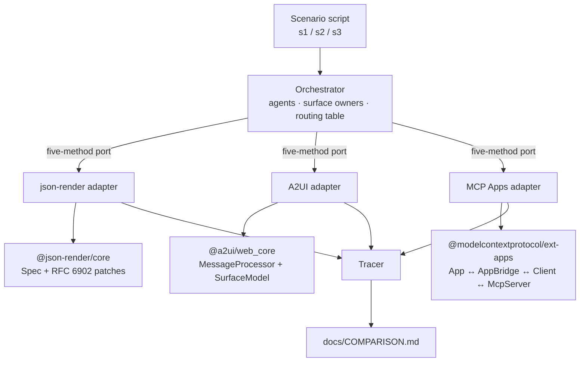

# How the harness works

The point of the design is that the three protocols are compared **under
identical pressure**. If each protocol had its own scenario, or its own idea of
what "a block of UI" is, the matrix would be measuring the harness rather than
the protocols.

## The shape



## The port

Everything flows through five methods, defined in
[`src/orchestrator/types.ts`](../src/orchestrator/types.ts):

| Method | Question it asks the protocol |
| --- | --- |
| `createSurface(surfaceId, agent)` | Can you open a named region owned by an agent? |
| `emit(surfaceId, agent, block)` | Can this agent draw into it? |
| `handoff(surfaceId, from, to)` | Can a second agent take it over? |
| `dispatchUserAction(action)` | What does the host learn when the user clicks? |
| `snapshot()` | What would the user actually be looking at? |

The scenarios import nothing protocol-specific. They speak only `UiBlock` — a
titled block with labelled rows and optional controls — which was chosen
because the same three primitives exist in A2UI's basic catalog and are trivial
to write as MCP Apps HTML. No protocol is flattered by the vocabulary.

## Recording rather than working around

When a protocol cannot do something, the adapter does **not** simulate it. It
calls `tracer.record(capability, outcome, detail, evidence)` and moves on. The
outcome vocabulary is fixed so the cells stay comparable:

`SUPPORTED` · `SUPPORTED_WITH_CAVEAT` · `REQUIRES_OUT_OF_BAND` ·
`NOT_EXPRESSIBLE` · `ENFORCED` · `LOST`

`evidence` carries the actual message, metadata or error the SDK produced, which
is what makes a claim in the report falsifiable.

## Why the orchestrator keeps a routing table

`Orchestrator` maintains a `control-id → agent` map. That is not a convenience —
it is instrumentation. Every entry in it is identity the protocol failed to
carry, so `outOfBandRoutingEntries` and the `viaOutOfBandTable` flag on each
delivery measure how much the orchestrator had to remember on the protocol's
behalf. Scenario 3's verdict for json-render and A2UI comes directly from it.

## What "real SDK" means per protocol

**json-render.** The adapter builds a `Spec` and mutates it only through
`applySpecPatch` from `@json-render/core`; the result is validated by
`catalog.validate()` after every emit. The browser page renders it with
`createRenderer` from `@json-render/react`, and buttons dispatch through
json-render's own `emit()` event resolution.

**A2UI.** The adapter sends `createSurface` / `updateComponents` /
`updateDataModel` messages, each parsed by `A2uiMessageSchema` before the
renderer sees it, into a real `MessageProcessor`. Surface state, component tree,
data model and action events are A2UI's own. The adapter takes its catalog as a
constructor argument: Node tests pass a schema-only catalog built from A2UI's
published component APIs, and the browser page passes `basicCatalog` from
`@a2ui/lit`, so the very same adapter drives the real Lit renderer.

**MCP Apps.** Every leg is the shipped SDK:

```text
App (view)  ←ui/*→  AppBridge (host)  ←MCP→  Client  ←→  McpServer
```

Tools and `ui://` resources are registered with `registerAppTool` and
`registerAppResource`. Under Node both legs use in-memory transports. In the
browser the view leg is a genuine `PostMessageTransport` to an iframe sandboxed
without `allow-same-origin`, so the view really does run in an opaque origin.

## Two browser-only details

Both are consequences of MCP Apps' isolation, and both cost host authors real
work — see the matching section in [COMPARISON.md](COMPARISON.md).

1. **CORS.** An opaque-origin document fetches module scripts with
   `Origin: null`, so the harness's dev server sets
   `Access-Control-Allow-Origin: *`. This does not weaken the sandbox; the
   sandbox is what creates the requirement.
2. **Readiness.** `ui/initialize` is a request, and one posted before the host
   attaches its listener is lost. The host and view exchange a small ready/ack
   pair before `connect()` — the equivalent of the spec's
   `ui/notifications/sandbox-proxy-ready`, which only exists in the
   sandbox-proxy flow.

## The report cannot go stale

`npm run report` regenerates [COMPARISON.md](COMPARISON.md) from the traces, and
`tests/protocol/conformance.test.ts` fails if the committed file differs from
what the code produces. A run-varying timestamp in A2UI's action envelope is
replaced with `<timestamp>` so the check measures drift in findings, not clocks.

## Adding a protocol

1. Implement `ProtocolAdapter` in `src/adapters/<name>/`.
2. Add the id to `ProtocolId` and to `PROTOCOLS` in `src/scenarios/run.ts`.
3. Record an outcome for each capability in
   `CAPABILITIES` (`src/report/generate.ts`); a missing cell renders as `—`.
4. Add the expected cells to `tests/protocol/scenarios.test.ts`.
5. Add a host page in `web/` and a spec in `tests/browser/`.
6. `npm run report`.
