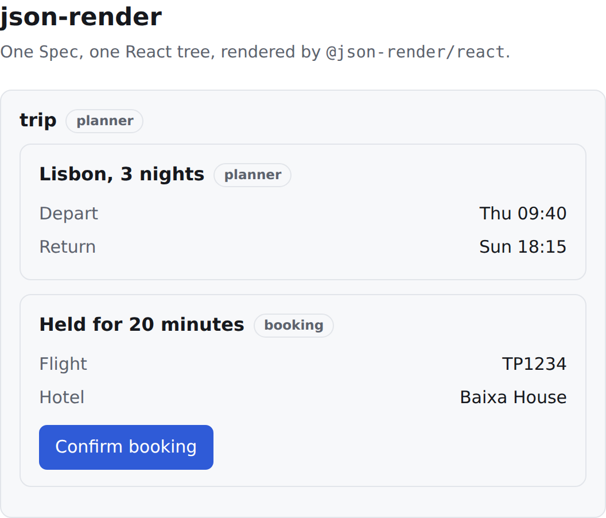
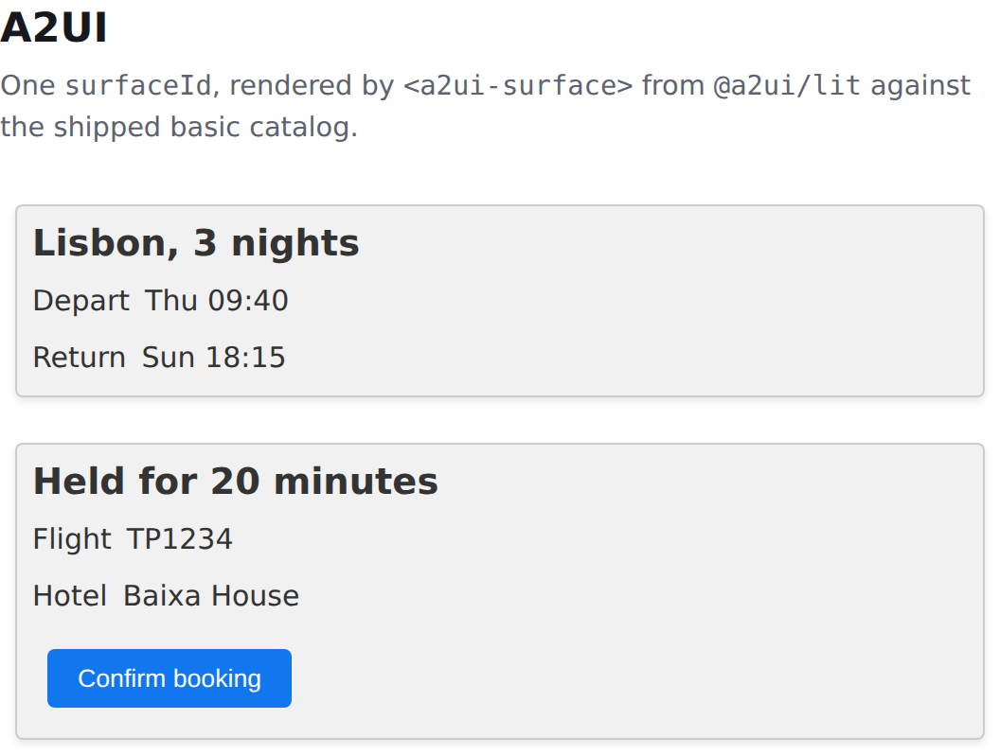
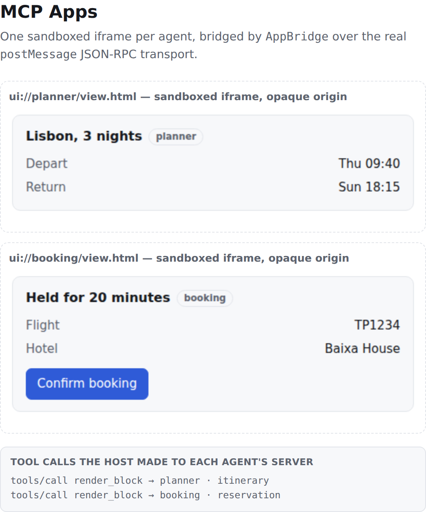
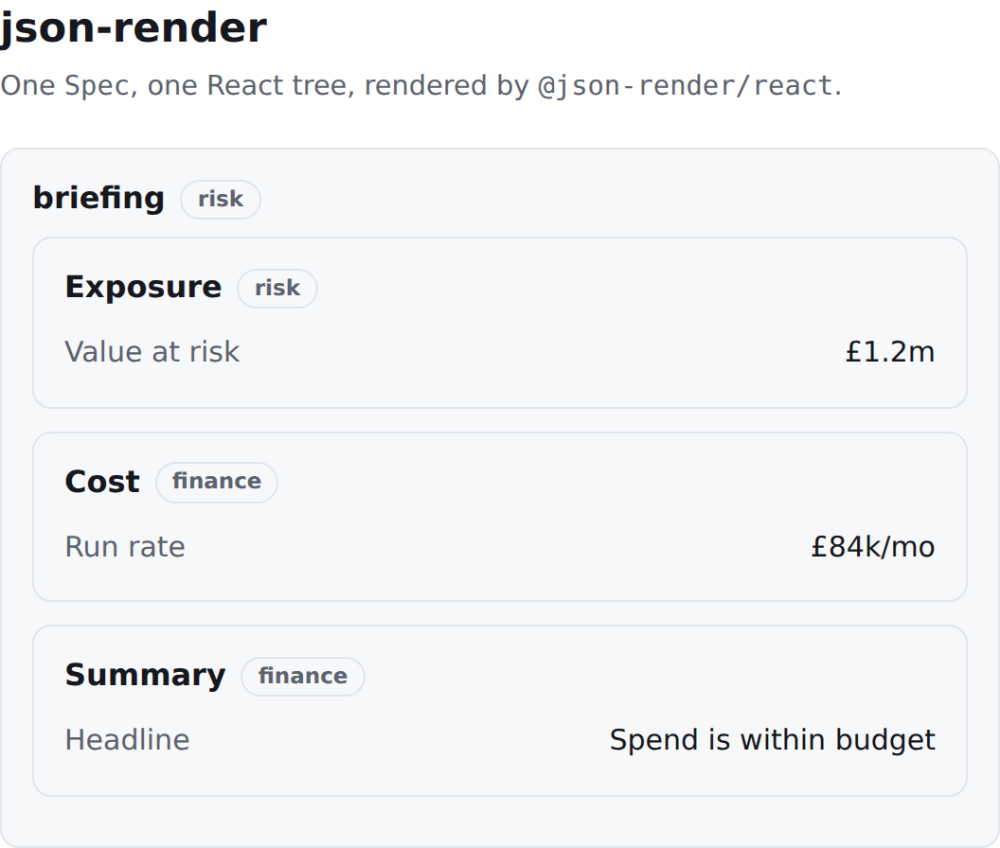
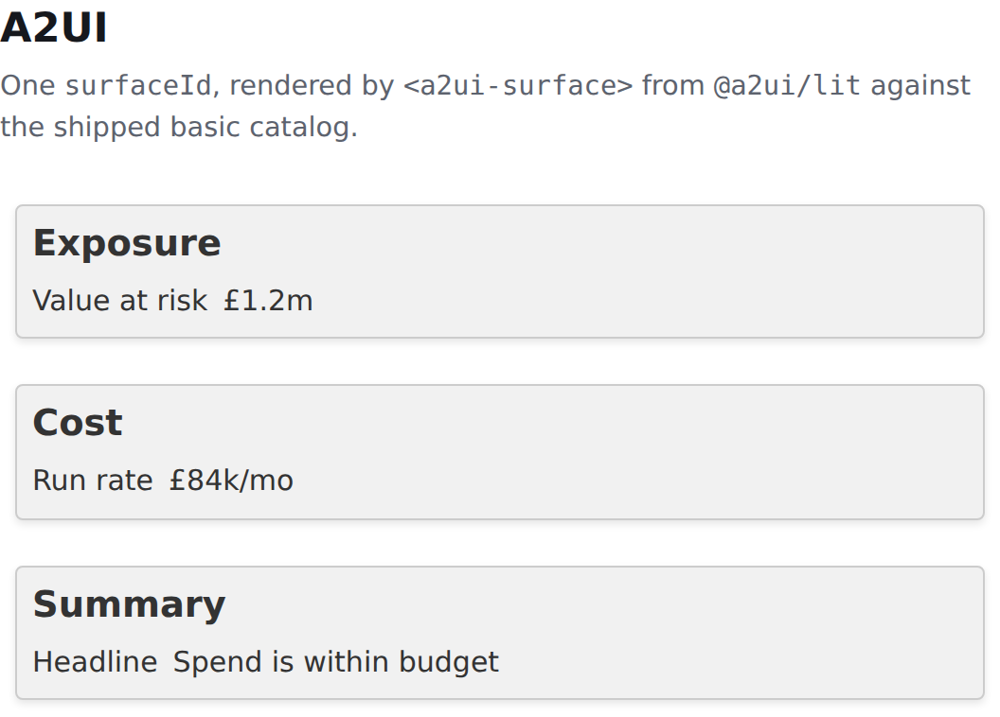
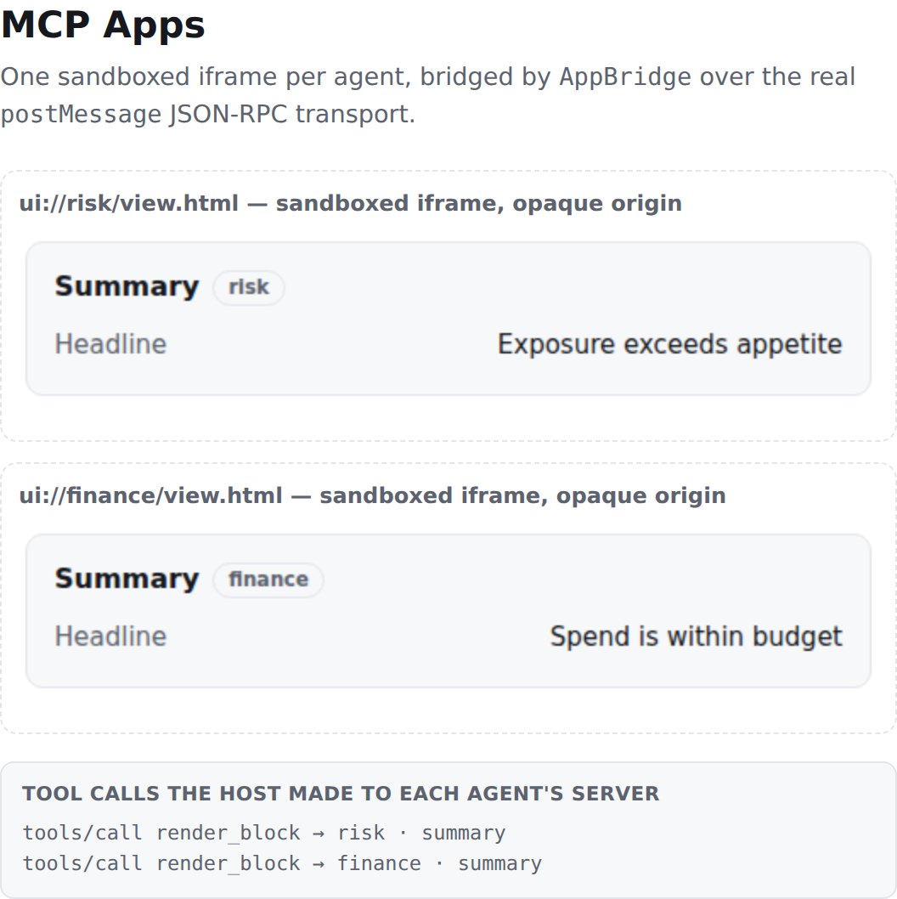
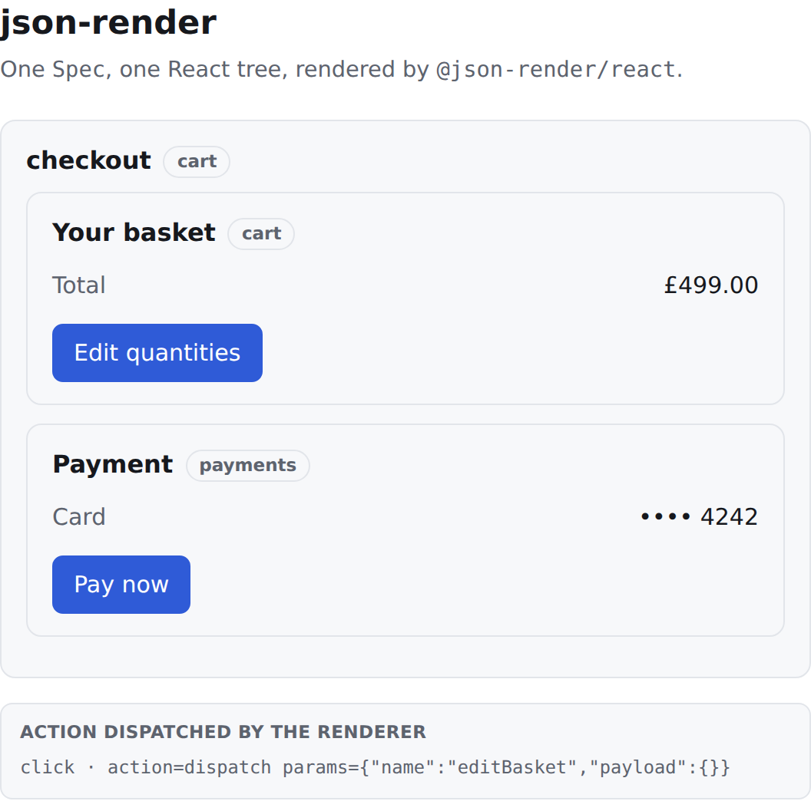
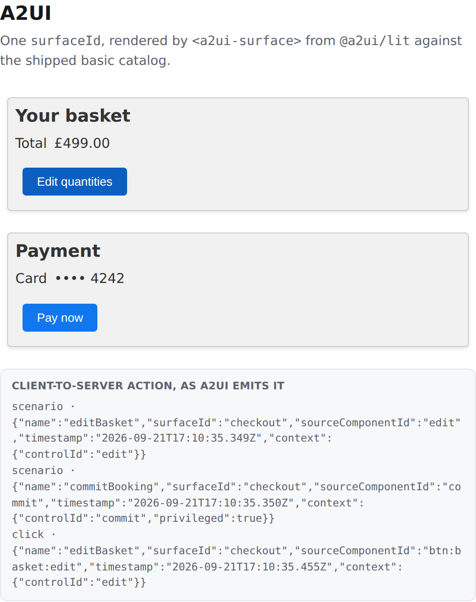
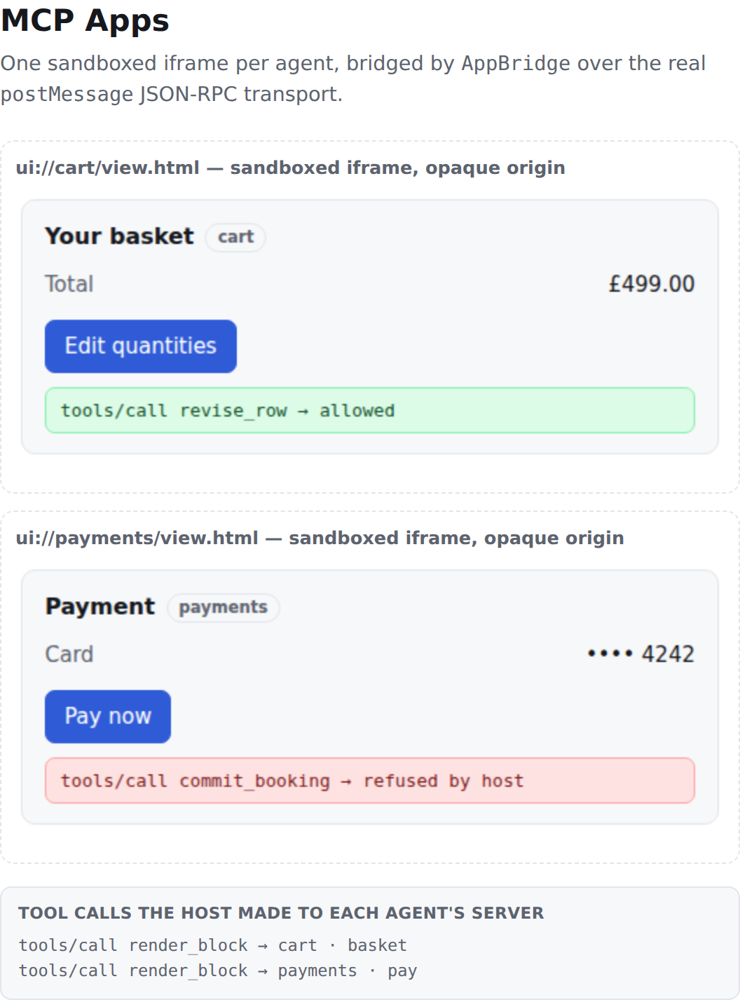

<!--
  HISTORICAL GENERATED FILE — do not treat as current generated evidence.
  This retained report predates the current outcome vocabulary. It has not been
  regenerated or freshness-checked against the supplied current source.
-->

# json-render vs A2UI vs MCP Apps, for multi-agent orchestration

Three scenarios, three protocols, one orchestrator. Every outcome below was
recorded by an adapter driving the protocol's published SDK — not by reading a
specification and forming an opinion about it.

- **json-render** — `@json-render/core + @json-render/react`
- **A2UI** — `@a2ui/web_core (v0.9 schema)`
- **MCP Apps** — `@modelcontextprotocol/ext-apps (SEP-1865) + @modelcontextprotocol/server`

Screenshots throughout are captured by `npm run screenshots` from the same
pages the browser suite asserts against.

## The matrix

| Capability | json-render | A2UI | MCP Apps |
| --- | --- | --- | --- |
| **Continue another agent's surface**<br><sub>Can agent B keep drawing into the view agent A started?</sub> | 🟡 caveat | ✅ supported | ❌ not expressible |
| **Attribute a write to an agent**<br><sub>Can the host tell which agent produced a given piece of UI?</sub> | ❌ not expressible | ❌ not expressible | 🔒 enforced |
| **Isolate agents from each other**<br><sub>Can one agent read or overwrite another's rendered surface?</sub> | ❌ not expressible | 🟡 caveat | 🔒 enforced |
| **Compose into one view**<br><sub>Can several agents present as a single answer?</sub> | 🟡 caveat | ✅ supported | ❌ not expressible |
| **Retain both summaries after a fixed-order collision**<br><sub>What happens when two agents write the same id?</sub> | 🔴 write lost | 🔴 write lost | 🧩 retained in separate instances (tested topology) |
| **Route an action to its agent**<br><sub>Does the event say which agent should handle it?</sub> | 🟠 out-of-band | 🟠 out-of-band | ✅ supported |
| **Gate a privileged action**<br><sub>Can anything below the agent withhold a dangerous action?</sub> | 🟡 caveat | ❌ not expressible | 🔒 refused by tested host handler |

Historical outcome vocabulary: **✅ supported** the protocol expresses it directly ·
**🟡 caveat** expressed, but something the orchestrator needs was weakened ·
**🟠 out-of-band** only works because the orchestrator keeps state the protocol
does not carry · **❌ not expressible** no way to say it · **🔒 enforced** a
tested mechanism refused the operation · **🧩 retained in separate instances
(tested topology)** separate app instances retained both values in this adapter
mapping; it is not collision enforcement or a protocol-wide result · **🔴 write lost** content
was silently dropped. The supplied current source additionally defines
`ENFORCED_BY_CONFORMANT_HOST`, labelled **🔒 enforced by conformant host**.

> **Configuration scope and confounders.** This matrix compares tested
> SDK/adapter/host configurations, not protocols in isolation. Adapter
> bookkeeping, shared-root coordination, naming conventions, host enforcement,
> catalogs, rendering frameworks, transports, and the one-server-per-agent MCP
> topology differ simultaneously. A matched-topology intervention has not been
> performed, so no protocol ranking or security/composition tradeoff is
> established.

## What the matrix means if you are building an orchestrator

**No tested configuration here does all three jobs.** In these adapter/host/
topology configurations, json-render and A2UI expose shared mutable state that
agents can address, while the one-server-per-agent MCP Apps configuration
retains separate instances. This is not an isolated protocol comparison: a
matched-topology intervention has not been performed, so these observations do
not establish protocol-level state, isolation, composition, or security behavior.

**For the tested A2UI configuration, agents can present as one answer.** Its
surface boundary lets a second agent continue a first agent's view in this
adapter, while the adapter still uses a control-id-to-agent routing table and
does not implement an approval gate. A matched-topology intervention would be
needed before generalizing these configuration observations to A2UI itself.

**For the tested MCP Apps host configuration**, the host-installed visibility
refusal and connection-bound attribution are configuration observations. The
visibility refusal is not SDK-default behavior, and the one-server-per-agent
mapping was not compared with a matched topology. In this harness, the separate
instances leave layout of multiple agents' output to the host; that result is
not established as a protocol effect.

**json-render is the strongest single-agent streaming format of the three** and
the weakest multi-agent one, for the same reason: the flat element map makes
every patch cheap and every element reachable by every writer. Its `confirm`
block is the only declarative consent primitive in the comparison — but the
agent drawing the button decides whether to include it, which makes it a good
default rather than a control.

**The gap none of the three closes: agent identity in the payload.** Neither
json-render's `Spec`/`UIElement` nor A2UI's four message types has a field
for the agent that produced a piece of UI. MCP Apps gets identity only as a side
effect of binding views to connections, which is also what stops it composing.
An orchestrator that wants both composition and attribution has to invent an
envelope today.

## A finding about MCP Apps worth stating separately

SEP-1865 says a host MUST reject a `tools/call` from an app for a tool that is
not app-visible ([specification source](https://github.com/modelcontextprotocol/ext-apps/blob/6d9bdc7babf275b759225aa722cbf5510c4c6021/specification/draft/apps.mdx)). That rule is delegated to the host, and the reference
`AppBridge` does not implement it. `AppBridge.connect()` installs:

```js
this.oncalltool = async (params, extra) =>
  this._client.request({ method: "tools/call", params }, { signal: extra.mcpReq.signal });
```

No visibility check. The SDK exports `isToolVisibilityModelOnly` for host
authors to apply themselves, so a host that never overrides `oncalltool`
type-checks cleanly and ships the spec's central security guarantee switched
off. The specification source is [MCP Apps extension specification, draft/apps.mdx](https://github.com/modelcontextprotocol/ext-apps/blob/6d9bdc7babf275b759225aa722cbf5510c4c6021/specification/draft/apps.mdx).
The harness runs scenario 3 both ways — `enforceVisibility: true` and
`false` — and the privileged tool call succeeds in the second, which is why the
same protocol appears as a tested host-handler refusal and **🟠 out-of-band**
depending on one line in harness-authored host code, rather than SDK-default
behavior. The pinned live-web reference was inspected as documentation; no
archived copy is provided here, so it may later be inaccessible.

## Two things only the browser run shows

The protocol suite cannot see either of these, and both cost real work in a
host.

**A sandboxed view cannot load its own code without CORS.** SEP-1865 requires
views to run in an iframe sandboxed without `allow-same-origin`, which gives the
document an opaque origin. Its module scripts are then fetched with
`Origin: null`, and any server that does not send
`Access-Control-Allow-Origin` blocks them — the view never boots. The harness's
dev server sets the header for exactly this reason. This is why the spec has
hosts serve app content from a dedicated origin via `_meta.ui.domain`, and why
its sandbox-proxy architecture delivers HTML inline through
`ui/notifications/sandbox-resource-ready` rather than by URL.

**The view needs a readiness signal the URL-loading path does not give it.**
`ui/initialize` is a request; if the view posts it before the host has attached
its message listener, it is lost and the App waits forever. The spec covers this
with `ui/notifications/sandbox-proxy-ready` in the sandbox-proxy flow, but a
host that loads a view by `src` has to build the equivalent itself — the
harness's host and view exchange a small ready/ack pair before `connect()`.
Neither json-render nor A2UI has an equivalent problem, because their renderers
are in the host's own document.

## Scenario detail

### Surface handoff mid-render

`s1-surface-handoff`

#### json-render



Rendered regions the user ends up with: **1** (`trip`)

**handoff.continue-surface** — 🟡 caveat

> Agent "booking" can continue the surface "planner" started by applying JSON Patch ops to the same flat element map — no re-render, no new surface, and the user sees one continuous view. The caveat is that this works because json-render grants every writer the whole keyspace: there is no per-element owner, so "continue" and "overwrite someone else's work" are the same operation, and the spec carries nothing a host could use to tell them apart.

**handoff.provenance** — ❌ not expressible

> The Spec type is { root, elements, state }; UIElement is { type, props, children, on, visible, repeat, watch }. None of them has a field for the agent that produced the element. The harness's "writtenBy" is an ordinary prop in its own catalog, which any agent can set to any value, so a host cannot use it to attribute or authorize a write.

**handoff.isolation** — ❌ not expressible

> There is no isolation boundary to speak of. One Spec renders into one React tree in one document, and any writer can patch any path — including /state, which every element's bindings read from. A misbehaving agent can rewrite another agent's rows, retarget its buttons' action bindings, or hide its elements with a visible condition, and the renderer will do it faithfully because a patch is a patch. That is fine when the orchestrator wrote all the agents; it is not a foundation for running agents you did not.

**compose.shared-surface** — 🟡 caveat

> Agents ["planner"] and "booking" write into one Spec and compose into a single rendered tree with no coordination step. For blocks with distinct keys this is the best experience of the three: one view, one layout pass, no seams. The caveat is that the keyspace is global and unowned, so composing and clobbering are the same operation and the protocol offers nothing to tell them apart.

#### A2UI



Rendered regions the user ends up with: **1** (`trip`)

**handoff.continue-surface** — ✅ supported

> Agent "booking" continues surface "trip" by sending further updateComponents and updateDataModel messages against the same surfaceId. The surface is a first-class, addressable thing with its own component tree and data model, so a second agent can append to it, patch one value in it, or replace one node — without re-sending what "planner" drew and without the user seeing a new panel appear.

**handoff.provenance** — ❌ not expressible

> The four v0.9 message types are createSurface, updateComponents, updateDataModel and deleteSurface. Each carries a surfaceId; none carries a sender. A renderer receiving a stream cannot tell that "booking" wrote the later components and "planner" wrote the earlier ones, so it cannot show attribution or refuse a write on the basis of who sent it.

**handoff.isolation** — 🟡 caveat

> The surface is a real boundary in one direction: an agent addressing surface X cannot touch surface Y, because every message names its surfaceId and the renderer keeps a separate SurfaceModel, component map and data model per surface. That is more than json-render offers. But it is a routing boundary, not a security one — inside a surface every agent shares the component-id and pointer namespaces, and all surfaces render into the same document with the same catalog and the same privileges. It partitions cooperating agents; it does not contain a hostile one.

**handoff.data-model-isolation** — 🟡 caveat

> The data model is per-surface and addressed by JSON Pointer, so "booking" can update /<block>/<row> without touching the component tree. Two agents writing different pointer subtrees genuinely do not collide — a real advantage over a single flat element map. The caveat is that the pointer space, like the id space, has no owner: nothing stops "booking" from overwriting a pointer "planner" is still using.

**compose.shared-surface** — ✅ supported

> Agents ["planner"] and "booking" compose into surface "trip" by addressing it by id. Two properties make this the most orchestration-friendly of the three arrangements: the surface is an explicit boundary, so agents working on *different* surfaces cannot reach each other at all; and within a surface the data model is addressed by JSON Pointer, so agents updating different subtrees are genuinely independent even when their components sit side by side. Component ids remain a shared, unowned namespace, which is where the collision in compose.identifier-collision comes from.

#### MCP Apps



Rendered regions the user ends up with: **2** (`trip::planner`, `trip::booking`)

**handoff.continue-surface** — ❌ not expressible

> There is no message in SEP-1865 that means "agent booking, continue the view agent planner is rendering". A view is instantiated by a tools/call and bound to the server that declared the tool and its ui:// resource; booking lives behind a different server, so calling booking's render tool produces a second App instance with its own iframe, its own origin and its own bridge. The host can place the two boxes next to each other, but the protocol has no notion of one continuing the other, and the user sees a new panel rather than the first one updating.

**handoff.provenance** — 🔒 enforced

> The flip side is that attribution is not something an agent can claim — it is a property of the connection. Each view is reachable only through the AppBridge the host created for one server, so the host knows a view is planner's without reading anything the view sent. Neither json-render nor A2UI can offer that, because in both of them any writer can address any part of the tree.

**handoff.isolation** — 🧩 sandbox configuration observed

> The tested host creates separate sandboxed iframes with `sandbox="allow-scripts"` and renders each agent's block only in its own frame. This is an architectural/configuration observation, not a validated defense against compromised content: the supplied browser test does not attempt cross-frame reads, forged bridge messages, unauthorized server calls, CSP violations, or origin confusion.

**compose.shared-surface** — ❌ not expressible

> Agents ["planner"] and "booking" cannot compose into one surface. Each has its own App instance, its own sandboxed iframe and its own origin, so what the user gets is N stacked panels rather than one view. Laying them out — ordering, sizing, deciding which is primary, reconciling their headings — is entirely the host's problem, and the protocol gives the host nothing to work with beyond ui/notifications/size-changed. For an orchestrator whose whole job is to present several agents' work as one answer, this is the sharpest edge in MCP Apps.

**compose.identifier-collision** — 🧩 retained in separate instances (tested topology)

> In this tested one-server-per-agent adapter/topology configuration, component ids live inside separate app instances, so "booking" reusing block id "reservation" does not overwrite the instance rendered for "planner". This is configuration-scoped instance separation, not collision enforcement or a protocol-level result.

### Fixed-order sequential identifier collision

`s2-fixed-order-collision`

> **Fixture distinction.** The four-write Node fixture is the classification
> evidence. Browser screenshots and assertions are a separate two-summary-write
> fixture (risk/summary then finance/summary); they do not corroborate the full
> four-write Node result.

#### json-render



Rendered regions the user ends up with: **1** (`briefing`)

**compose.shared-surface** — 🟡 caveat

> Agents ["risk"] and "finance" write into one Spec and compose into a single rendered tree with no coordination step. For blocks with distinct keys this is the best experience of the three: one view, one layout pass, no seams. The caveat is that the keyspace is global and unowned, so composing and clobbering are the same operation and the protocol offers nothing to tell them apart.

**compose.identifier-collision** — 🔴 write lost

> Agent "finance" replaced block "summary" previously written by "risk". json-render patches address a flat, shared element map: /elements/block:summary is a single slot with no owner, so the earlier agent's content is gone and neither agent is told.

#### A2UI



Rendered regions the user ends up with: **1** (`briefing`)

**compose.shared-surface** — ✅ supported

> Agents ["risk"] and "finance" compose into surface "briefing" by addressing it by id. Two properties make this the most orchestration-friendly of the three arrangements: the surface is an explicit boundary, so agents working on *different* surfaces cannot reach each other at all; and within a surface the data model is addressed by JSON Pointer, so agents updating different subtrees are genuinely independent even when their components sit side by side. Component ids remain a shared, unowned namespace, which is where the collision in compose.identifier-collision comes from.

**compose.identifier-collision** — 🔴 write lost

> Agent "finance" reused component ids from block "summary", last written by "risk". updateComponents is keyed by component id within a surface, so re-sending an id replaces that node. The surface boundary stops agents on *different* surfaces from colliding, but inside one surface the id space is still shared and unowned.

#### MCP Apps



Rendered regions the user ends up with: **2** (`briefing::risk`, `briefing::finance`)

**compose.shared-surface** — ❌ not expressible

> Agents ["risk"] and "finance" cannot compose into one surface. Each has its own App instance, its own sandboxed iframe and its own origin, so what the user gets is N stacked panels rather than one view. Laying them out — ordering, sizing, deciding which is primary, reconciling their headings — is entirely the host's problem, and the protocol gives the host nothing to work with beyond ui/notifications/size-changed. For an orchestrator whose whole job is to present several agents' work as one answer, this is the sharpest edge in MCP Apps.

**compose.identifier-collision** — 🧩 retained in separate instances (tested topology)

> In this tested one-server-per-agent adapter/topology configuration, component ids live inside one app instance, so "finance" reusing block id "finance-detail" cannot overwrite anything ["risk"] rendered — the two are not in the same document, the same origin, or the same protocol conversation. This is configuration-scoped structural isolation, not protocol-level collision enforcement; a matched-topology comparison is required for that stronger claim.

### Action round-trip and approval gate

`s3-action-roundtrip`

#### json-render



Rendered regions the user ends up with: **1** (`checkout`)

**compose.shared-surface** — 🟡 caveat

> Agents ["cart"] and "payments" write into one Spec and compose into a single rendered tree with no coordination step. For blocks with distinct keys this is the best experience of the three: one view, one layout pass, no seams. The caveat is that the keyspace is global and unowned, so composing and clobbering are the same operation and the protocol offers nothing to tell them apart.

**action.routing-identity** — 🟠 out-of-band

> The dispatched event is {"name":"editBasket","payload":{}} against local handler "dispatch". json-render actions resolve to a handler in the *client's* catalog, so the event names a function, not an addressee. With several UI-capable agents behind one orchestrator, the orchestrator must keep its own control-id to agent table and keep it in sync with every patch, including patches written by agents it did not schedule.

**action.approval-gate** — 🟡 caveat

> The privileged control carries a confirm block ({"title":"Confirm action","message":"Allow commitBooking?","variant":"danger"}) inside the action binding, and json-render's renderer honours it: it shows the dialog and withholds the dispatch until the user agrees. Of the three protocols this is the only declarative consent primitive. The caveat is decisive for multi-agent use, though — the confirm block is written by the agent that drew the button. An agent that simply omits it gets an ungated action, and nothing in the spec marks the action as one that needed a gate. It is a good default for agents you wrote; it is not a control over agents you did not.

#### A2UI



Rendered regions the user ends up with: **1** (`checkout`)

**compose.shared-surface** — ✅ supported

> Agents ["cart"] and "payments" compose into surface "checkout" by addressing it by id. Two properties make this the most orchestration-friendly of the three arrangements: the surface is an explicit boundary, so agents working on *different* surfaces cannot reach each other at all; and within a surface the data model is addressed by JSON Pointer, so agents updating different subtrees are genuinely independent even when their components sit side by side. Component ids remain a shared, unowned namespace, which is where the collision in compose.identifier-collision comes from.

**action.routing-identity** — 🟠 out-of-band

> The client-to-server action is {"name":"editBasket","surfaceId":"checkout","sourceComponentId":"edit","timestamp":"<timestamp>","context":{"controlId":"edit"}}. It is a genuinely useful envelope: surfaceId and sourceComponentId let an orchestrator narrow the event to one surface and one node, and timestamp lets it order events. What it does not carry is the agent. An orchestrator running several UI-capable agents on one surface still has to keep a component-id to agent table, or encode the agent into the free-form context and then trust whatever arrives there — which is a claim from the UI, not an authenticated identity.

**action.approval-gate** — ❌ not expressible

> A2UI v0.9 has no confirmation or consent primitive on an action. The Button's action is { event: { name, context } }; there is no field a host could read to know this action needs the user's explicit approval, and no protocol step between the click and the emitted event. Gating a privileged action means the agent drawing a Modal and hoping — which is precisely the "trust the agent" posture the declarative format is supposed to avoid.

#### MCP Apps



Rendered regions the user ends up with: **2** (`checkout::cart`, `checkout::payments`)

**compose.shared-surface** — ❌ not expressible

> Agents ["cart"] and "payments" cannot compose into one surface. Each has its own App instance, its own sandboxed iframe and its own origin, so what the user gets is N stacked panels rather than one view. Laying them out — ordering, sizing, deciding which is primary, reconciling their headings — is entirely the host's problem, and the protocol gives the host nothing to work with beyond ui/notifications/size-changed. For an orchestrator whose whole job is to present several agents' work as one answer, this is the sharpest edge in MCP Apps.

**compose.identifier-collision** — 🧩 retained in separate instances (tested topology)

> In this tested one-server-per-agent adapter/topology configuration, component ids live in separate app instances, so the two rendered values are retained separately. This is configuration-scoped instance separation, not collision enforcement or a protocol-level result.

**action.routing-identity** — ✅ supported

> The view's tools/call arrived over the AppBridge the host created for agent "cart"'s server. The orchestrator therefore knows the originating agent from the channel the message came in on, with no control-id table to maintain and nothing in the payload to trust. This is the one protocol of the three where a click is attributable by construction.

**action.approval-gate** — 🔒 refused by tested host handler

> The host refused the view's tools/call for "commit_booking": Host refused tools/call from app: "commit_booking" is model-visible only. The tool's _meta.ui.visibility is ["model"], so a view may not invoke it however the agent drew the button. The refusal happens in the harness-authored enforcing host handler, above the server; it is not SDK-default behavior. The agent that authored the UI has no way to talk its way past that installed handler — which is a materially stronger guarantee than a confirmation dialog the same agent could have chosen not to request.
